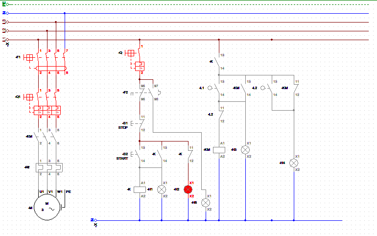
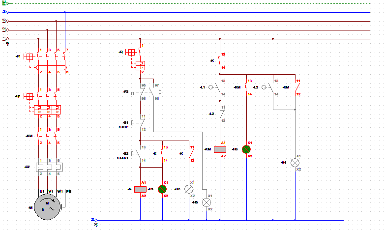
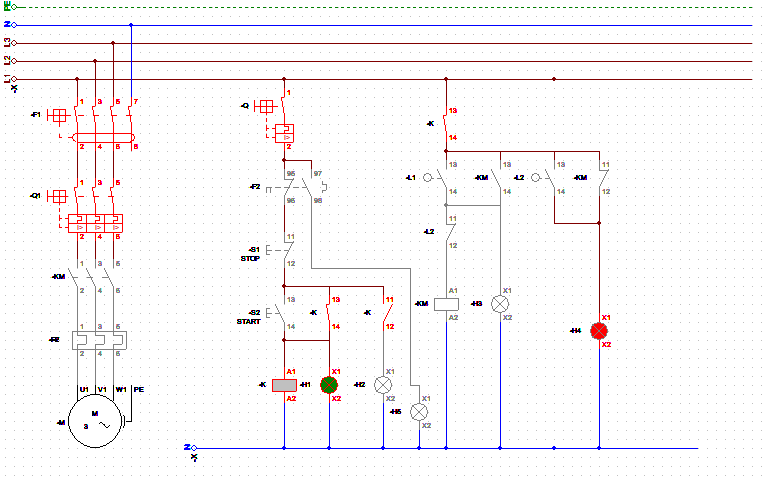
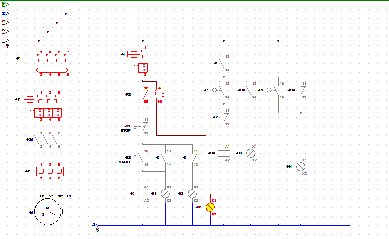

# Conveyor-System-Control-Using-Classic-Control-and-Limit-Switches
## Introduction
The project involves the design and implementation of a classic control system for a conveyor system using limit switches. The primary objective was to control the movement of the conveyor belt based on the presence or absence of objects, ensuring automated operation and stopping the conveyor at precise points. This project demonstrates the application of classic control techniques, incorporating mechanical and electrical components for reliable system operation.

## Objectives
- Automate Conveyor Operation: Enable automatic stopping and starting of the conveyor system.
- Object Detection: Use limit switches to detect objects on the conveyor belt.
- Precise Positioning: Halt the conveyor system when an object reaches specific positions for further processing.
- Safety Integration: Incorporate a manual override to stop the conveyor in emergencies.

## Components Used
1. AC Induction Motor
2. Differential Switch III
3. Magnetothermic Switch III
4. Contactor
5. Thermal Relay
6. Magnetothermic Switch I
7. Start/Stop Push Buttons
8. (2) Limit Switches
9. Lamp Indicators
10. Relay

## System Design

### Circuit Description
1. Control Circuit
   - A Start push button energizes the main contactor coil, initiating the Relay of the control circuit.
   - Stop push button de-energizes the relay, halting the motor.
   - Limit switches are wired in series with the control circuit, acting as additional inputs to stop the conveyor.
2. Power Circuit
   - Provides three-phase power to the motor through the contactor.
   - Overload relay is integrated into the circuit for motor protection.
### Limit Switch Functionality
- Position 1 Limit Switch (LS1): Starts the conveyor when an object is detected at the start of the conveyor.
- Position 2 Limit Switch (LS2): Stops the conveyor when an object reaches the end for further processing or unloading.

## Simulation Result

- The system starts when the Start button is pressed, energizing the Relay.

- When an object triggers LS1, the conveyor starts, allowing inspection or processing at the first position.
- After processing, the conveyor resumes, and the object continues along the belt.
- When the object triggers LS2, the conveyor stops at the unloading point.

- In case of Overload:

## Advantages
- Reliability: Classic control systems are simple and robust, ensuring consistent operation.
- Cost-Effective: The system uses readily available and low-cost components.
- Safety: Limit switches prevent overrun and allow precise control of object positions.
- Manual Control: Operators can override the system when required using the push buttons.

## Applications
- Manufacturing: For assembly line automation and object positioning.
- Packaging: Controlling the movement of items for sorting or packing.
- Material Handling: Automating processes in warehouses and logistics centers.

## Conclusion
The project successfully demonstrates the use of classic control techniques to automate a conveyor system. By integrating limit switches, the system achieves precise control of object movement, enhancing productivity and reliability. This project highlights the practicality and effectiveness of classic control systems in industrial automation.
Further improvements could include the addition of sensors for more advanced control or integration with PLCs for greater flexibility.

