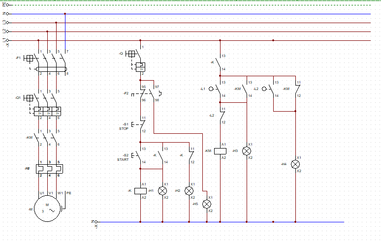

# Conveyor-System-Control-Using-Classic-Control-and-Limit-Switches
## Introduction
The project involves the design and implementation of a classic control system for a conveyor system using limit switches. The primary objective was to control the movement of the conveyor belt based on the presence or absence of objects, ensuring automated operation and stopping the conveyor at precise points. This project demonstrates the application of classic control techniques, incorporating mechanical and electrical components for reliable system operation.

## Objectives
- Automate Conveyor Operation: Enable automatic stopping and starting of the conveyor system.
- Object Detection: Use limit switches to detect objects on the conveyor belt.
- Precise Positioning: Halt the conveyor system when an object reaches specific positions for further processing.
- Safety Integration: Incorporate a manual override to stop the conveyor in emergencies.

## Components Used
1. AC Induction Motor
2. Differential Switch III
3. Magnetothermic Switch III
4. Contactor
5. Thermal Relay
6. Magnetothermic Switch I
7. Start/Stop Push Buttons
8. (2) Limit Switches
9. Lamp Indicators
10. Relay

## System Design

